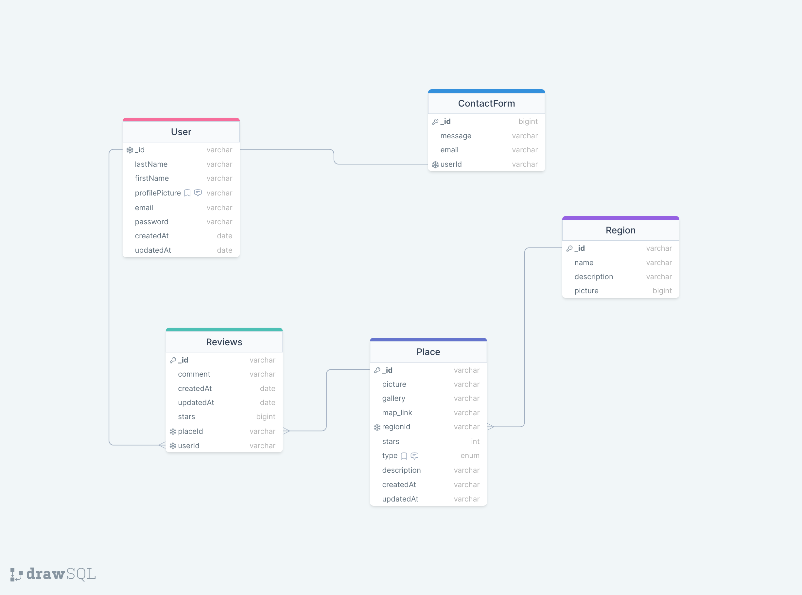

# Tourism-App-Backend

## Description

This is the backend for the Tourism App by Micro Club. It is a REST API built with Node.js, Express.js, and MongoDB.

## Installation

1. Clone the repository
2. Run `npm install` to install dependencies
3. Run `npm start` to start the server
4. Run `npm run dev` to start the server in development mode

## Usage

The server will be running on port 8000 by default. You can use Postman to test the API endpoints.

## DB Schema

## API Endpoints

<strong>POST /api/v1/user/login</strong> : Login user
<strong>POST /api/v1/user/register</strong> : Register user
<strong>GET /api/v1/user/profile</strong> : Get user details

<strong>GET /api/v1/region</strong> : Get all regions
<strong>GET /api/v1/region/:id</strong> : Get region by id
<strong>POST /api/v1/region</strong> : Create new region
<strong>PUT /api/v1/region/:id</strong> : Update region by id
<strong>DELETE /api/v1/region/:id</strong> : Delete region by id

<strong>GET /api/v1/place</strong> : Get all places
<strong>GET /api/v1/place/:id</strong> : Get place by id
<strong>POST /api/v1/place</strong> : Create new place
<strong>PUT /api/v1/place/:id</strong> : Update place by id
<strong>DELETE /api/v1/place/:id</strong> : Delete place by id

<strong>POST api/v1/contact-us</strong> : Send contact us message

<strong>POST api/v1/reviews</strong> : Add review on place
<strong>GET api/v1/reviews</strong> : Get reviews
<strong>PATCH api/v1/reviews/:id</strong> : Update review
<strong>DELETE api/v1/reviews/:id</strong> : Delete review

## Contributors

- Micro Club USTHB is It is a student club at the University of Science and Technology Houari Boumediene (USTHB) in Algiers, Algeria. It was founded in 1985 by a group of students passionate about technology. The club aims to help students develop their technical skills and soft skills through workshops, events, and projects.

- Kemmoun Ramzy
- Salmi Siffeddine
- Kesbi Walid
- Yahiaoui Islam
- Ouzene Abdellah
